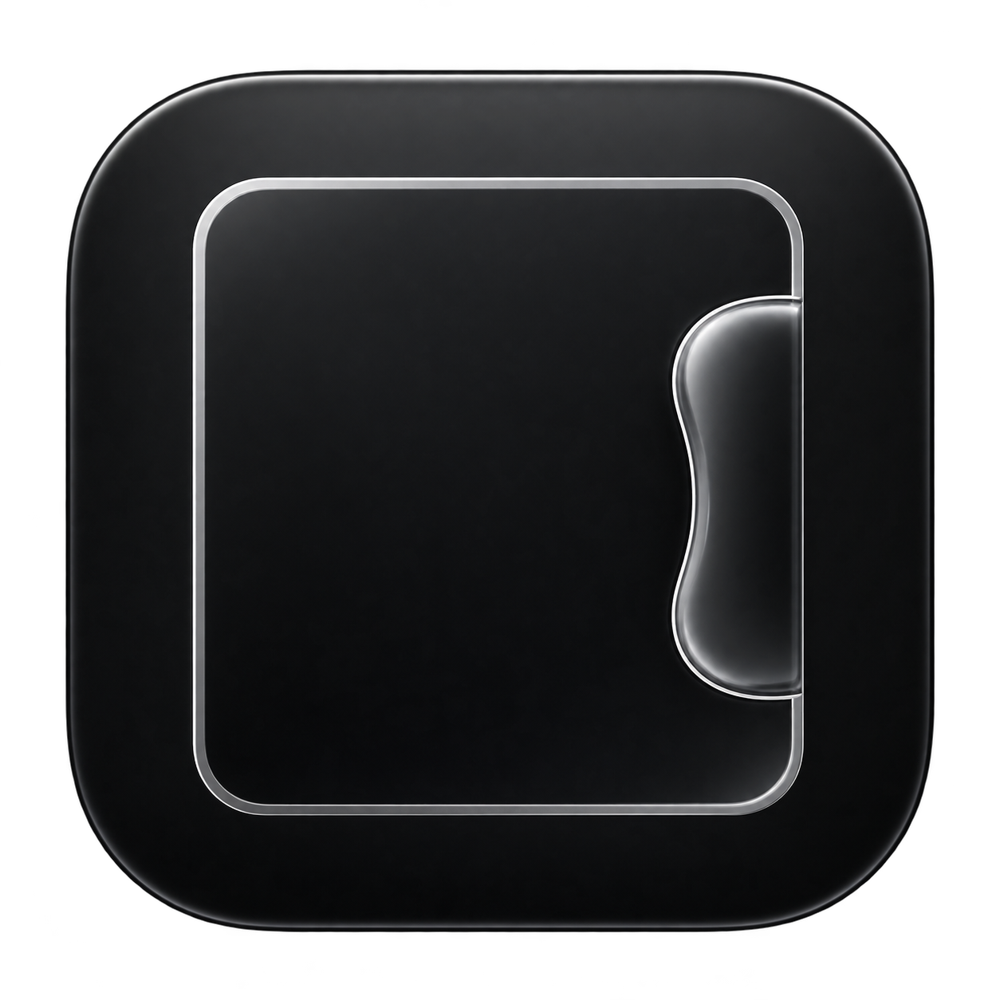
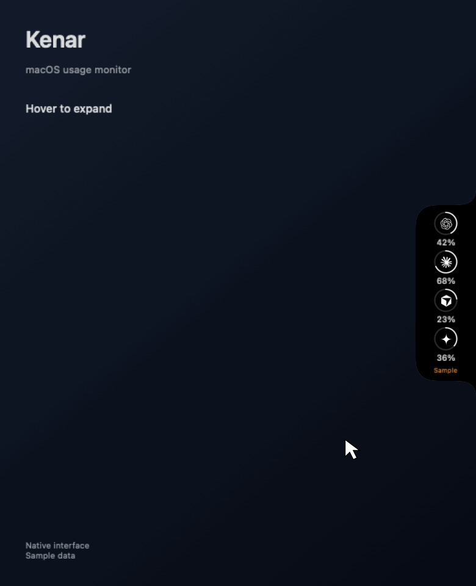

# Kenar



A native macOS usage monitor for **Claude, OpenAI, Cursor, and Google**. Kenar lives in a small, Dynamic Island–style glass panel attached to the left or right edge of your display.

Built with SwiftUI and AppKit. Requires **macOS 13 or later** and supports both Apple Silicon and Intel Macs.

## Preview



*Rendered from Kenar’s native SwiftUI interface with labeled sample data. OpenAI separates Codex / Work from ChatGPT Chat; Google separates Gemini from Antigravity. Missing percentages remain unknown. This animation demonstrates the interface, not live account validation.*

## Features

- **An unobtrusive edge island.** The collapsed island shows only providers with a successful, recent connection. Hover to expand it and inspect every enabled provider, including connection errors. Pin the panel to keep it open.
- **Quota details and reset countdowns.** See session, weekly, and model-specific limits when the provider exposes them. Unknown usage and reset times remain unknown.
- **Configurable alerts.** Default thresholds are 75%, 90%, and 100%, with separate settings for each provider. Alerts are deduplicated within each quota period, including across app restarts.
- **Local usage history.** Explore daily and weekly charts with provider, account and quota/model filters. History starts when Kenar runs and retains 90 days of successful measurements. Reset periods are drawn separately.
- **Project analytics.** Import token counters from local Claude Code, Codex, and Antigravity sessions, plus legacy Gemini CLI records. Antigravity generation records provide actual input, output, and cache counters; context percentages are never treated as consumption. Group projects by Git root and filter by session, week, month, or all time. Estimated quota attribution is clearly labeled where supported; it is not shown for Antigravity because model-to-quota-bucket mapping is unverified.
- **Display and appearance controls.** Choose a monitor, left or right edge, light/dark/system appearance, width, surface opacity, accent color, and text size. The panel falls back to the main display when its selected monitor disconnects.
- **English and Turkish.** Switch languages in Settings → Appearance → Language. The selection persists across restarts.
- **A background companion.** No Dock icon, optional launch at login, automatic quota refresh every two minutes, and manual refresh or connection retry. Optional CLI bridges remain available; account connections have their own saved sessions.

## Download

**[Download Kenar 1.5.1 (.app ZIP)](https://github.com/brkcnr/kenar/releases/download/v1.5.1/Kenar-1.5.1-macOS-universal.zip)** · [Download DMG](https://github.com/brkcnr/kenar/releases/download/v1.5.1/Kenar-1.5.1.dmg) · [Release notes](https://github.com/brkcnr/kenar/releases/tag/v1.5.1)

The ZIP contains `Kenar.app`. Extract it, quit an older running copy, move the app to Applications and launch it. Both downloads support Apple Silicon and Intel on macOS 13+. SHA-256 checksums and a Turkish installation guide are attached to the release.

## Build and install

Install Xcode Command Line Tools if needed:

```sh
xcode-select --install
```

Clone and build:

```sh
git clone https://github.com/brkcnr/kenar.git
cd kenar
bash build.sh
```

The build produces a universal `dist/Kenar.app` and `dist/Kenar.dmg`. Open the disk image, drag Kenar into Applications, then launch it. Move your pointer onto the island at the right edge of your main display to open the panel.

See the [Turkish installation guide](docs/INSTALL_TR.md) for the account setup steps.

The app is **ad-hoc signed and not notarized by Apple**. If macOS blocks it, review the app notice in System Settings → Privacy & Security.

## Account connections

In **Settings → Providers**, use **Connect / Reconnect / Disconnect** for each account. Complete sign-in in Kenar's own window. Your existing Claude session is preserved when upgrading. Choose a workspace when OpenAI or Claude returns more than one.

| Group | Quota scope | Source and current limitations |
| --- | --- | --- |
| Claude | Account/workspace windows shared by supported Claude surfaces | Kenar-owned web session; optional Code bridge/OAuth |
| OpenAI | Codex / Work; ordinary ChatGPT Chat is separate | Owned web login, agentic quota refresh and session persistence after the 1.5.1 upgrade were verified with one account. Chat is unknown unless an explicitly identified official Chat usage card reports it. Existing Codex OAuth remains optional. |
| Cursor | Explicitly reported Cursor Models and Other Models pools | Kenar-owned Cursor login, with defensive parsing and an official usage-card fallback. Legacy aggregate fields retain their original labels. Login, legacy numeric usage and restart persistence were verified with one account; named paid-plan pools still require live validation. |
| Google | Gemini web and Antigravity are separate products | Each connection reads only a visible official quota card in its own Kenar window. This is an experimental web reader: it is **not a verified independent Antigravity quota API**. If sign-in or quota reading is unavailable, Kenar reports that limitation. |

Account queries do not require a CLI or desktop app to remain running. Website verification, session expiry and unsupported usage formats are reported explicitly. The user may need to open a product's official usage card in the connection window and click **Read usage**. Google sign-in can reject embedded browsers; Kenar does not bypass that restriction or borrow another application's OAuth client. A successful login alone is not treated as a numeric quota connection.

**Quota scope matters.** [Codex and ChatGPT Work share agentic usage](https://learn.chatgpt.com/docs/pricing); ordinary ChatGPT Chat is not assigned that percentage. [Cursor documents two usage pools](https://cursor.com/docs/models-and-pricing). [Gemini web limits](https://support.google.com/gemini/answer/16275805?hl=en) and [Antigravity model quotas](https://antigravity.google/docs/models/) are separate sources; Kenar does not assume they share a baseline allowance or add their percentages. API-key billing is outside this version.

**Claude account:** choose **Claude account · Web login**. Kenar can refresh while Claude Code is closed, using its existing Claude-owned WebKit session. Other browsers' cookies and Claude Desktop credentials are not imported. See [Anthropic's shared-usage explanation](https://support.claude.com/en/articles/11647753-how-do-usage-and-length-limits-work).

**Optional CLI connections:** expand the corresponding settings section to use existing Codex OAuth, Cursor CLI credentials, or the agy quota bridge. These sources are labelled in details. Background Keychain reads suppress permission dialogs; a manual retry of an explicitly selected credential source may request access. Kenar never rotates CLI refresh tokens. For existing installations, Codex OAuth and the configured agy bridge remain selected until you switch to an account connection.

**Claude Code bridge:** **Connect Code quota bridge** registers `kenar-statusline.sh` in the selected Claude settings directory, preserving unrelated settings and refusing to overwrite a custom status line. The [official payload](https://code.claude.com/docs/en/statusline) supplies only subscription windows after Code reports them. The receiver discards conversation/context fields.

**Antigravity bridge:** the optional setup preserves existing agy settings and its default status line. An already-running session activates the launcher once:

```text
/statusline ~/.gemini/antigravity-cli/kenar-statusline.sh
/usage
```

This fallback reads the latest quota-only payload from agy. It **requires an active CLI session** and is not an independent Google account query. Measurements expire after five minutes. No Google OAuth credential is read. `/statusline delete` removes the active CLI hook.

**Antigravity project analytics:** Kenar opens local `conversations/*.db` and `conversation_summaries.db` read-only, importing generation token counters, model IDs and timestamps. Output already includes reasoning; cache reads are separate from the main total. A session with one workspace is grouped by its Git root. Missing or multiple workspaces remain unassigned instead of guessing a repository. Session, week, month and all-time filters use the same analytics screen as Claude and Codex. SQLite/protobuf formats are internal; unsupported or malformed records are skipped. No conversation titles, prompts, tool output or attachments are imported.

To remove the connection, run `/statusline delete` in `agy`; the launcher and Kenar's local quota file can then be deleted. Keep an active session's status line enabled while using this connection.

Expired tokens should be renewed in the corresponding CLI. Kenar does not use refresh tokens. A failed request preserves the last successful measurement and marks it stale; it never substitutes sample percentages. The collapsed island hides failed connections, while the expanded panel retains their details.

## Using the panel

Click a provider to inspect its quota windows and model details. Use the pin to keep the panel open and the edge-facing arrow to collapse it. The sliders button opens Settings; the clock and folder buttons open usage history and project analytics.

Right-click the island to refresh, retry a failed provider, open Settings, or quit. Opening and closing use the same pointer polling interval; closing has no extra cooldown. Only left and right edges are supported.

Enable notifications when prompted if you want threshold and reset reminders. A reset reminder reports the provider's scheduled time; Kenar fetches again rather than assuming that the quota has reset.

## Privacy and data

All analytics are local. Kenar has no telemetry, crash reporting service, or third-party backend.

- SQLite stores quota measurements, timestamps, opaque account/workspace identities, product/pool and provider/model identifiers, project paths, session/event identifiers, and token counters. The 1.5 migration creates an online SQLite backup and keeps older measurements marked **Legacy records · Account unknown**. Conversation text, tool output, and attachments are not stored.
- Data lives in `~/Library/Application Support/Kenar/`. Quota history retains 90 days; older local CLI token records can be imported for project analysis.
- Claude and Cursor may cache only a short-lived access token in Kenar's private data directory. Refresh tokens are neither used nor copied. CLI credential stores are read-only. Explicit bridge setup modifies only the selected CLI’s status-line settings and launcher.
- Requests use HTTPS to the respective provider. HTTP disk caching is disabled, and credentials cannot follow redirects to a different origin or to HTTP.
- Token counts are not directly comparable across providers and do not represent billing. Cache reads are reported separately.
- Web account usage is never assigned to local project tokens. For supported legacy local sources, project quota attribution is an **estimate** based on quota increases between measurements and matching local token events. Initial measurements and resets are not counted as consumption. Unexplained usage is kept separate; activity on another device cannot be assigned reliably to a local project.

`CLAUDE_CONFIG_DIR`, `CODEX_HOME`, `AGY_CONFIG_DIR` (Kenar bridge configuration directory), and `GEMINI_CLI_HOME` (legacy transcript import) are honored when present in the app's process environment. An app launched from Finder does not automatically inherit your terminal's environment.

See [SECURITY.md](SECURITY.md) for credential handling and endpoint limitations.

## Development and verification

The committed `assets/AppIcon-source.png` is the actual generated icon artwork. `Scripts/MakeIcon.swift` creates the normal/Retina PNG renditions and validates the resulting `.icns` through macOS ImageIO during each build.

No external Swift package dependencies are required. The scripts preserve the native SwiftPM output layout. Set `KENAR_SDK` to an installed SDK path when your toolchain needs an SDK override (for example, an older SDK if Command Line Tools lacks the new SwiftUI macro plugin). Run:

```sh
bash test.sh
bash build.sh
```

`test.sh` uses XCTest with full Xcode, or a standalone assertion runner for the same scenarios when only Command Line Tools are installed. The current suite contains **74 shell scenarios**, plus a native WebKit DOM fixture run separately in an application context (75 native scenarios passed). Build that check app with `bash build-native-checks.sh`, open `.build/Kenar Native Checks 1.5.app`, and inspect `.build/native-tests.log`. `build.sh` compiles both architectures, combines them into a universal app, signs it ad hoc, and verifies the disk image.

Inspect a live provider connection without printing tokens or raw response bodies:

```sh
bash verify.sh codex
bash verify.sh claude cursor antigravity
# Inspect actual Antigravity token totals in a separate local database:
bash inspect-antigravity.sh /tmp/kenar-antigravity-check.sqlite
```

Run an explicitly labeled preview with sample data:

```sh
KENAR_PREVIEW=1 dist/Kenar.app/Contents/MacOS/Kenar
```

Preview mode makes no provider requests, scans no local token records, and writes no history. [VALIDATION.md](VALIDATION.md) records tested behavior and remaining verification limits.

Regenerate the README animation on macOS using the same native views:

```sh
bash render-demo.sh
```

The renderer uses an isolated settings domain and sample data. It writes the GIF to `assets/kenar-demo.gif` and inspection frames to `.build/demo/`.

Some usage endpoints are internal provider interfaces rather than documented public APIs. Account compatibility and response formats may change.

## License and credits

Kenar is based on [Brink](https://github.com/semihtalii/brink), created by **Semih Tali** and released under the MIT license. The original copyright notice is preserved in [LICENSE](LICENSE) and the application bundle.

[UPSTREAM.md](UPSTREAM.md) identifies the upstream commit and adapted components.

The Antigravity generation field mapping was informed by the original [Tokdash parser](https://github.com/JingbiaoMei/Tokdash) and independently checked against installed CLI records. Kenar uses its own bounded Swift wire reader. See [THIRD_PARTY_NOTICES.md](THIRD_PARTY_NOTICES.md).
